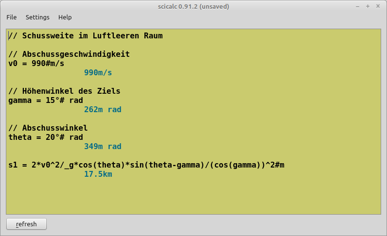

scicalc
=======



# Bedienungsanleitung
## 1. Einführung:
**scicalc** ist ein numerisches Berechnungsprogramm für den PC. Meiner Erfahrung nach gibt es hauptsächlich 2 Arten von Rechenprogrammen:
* kleine ungeschickte Taschenrechner, mit denen sich 2 Zahlen addieren lassen, aber nicht viel mehr.
* große Rechenmonster wie zb. Matlab oder Scilab, die lange zum Laden brauchen und schwierig zu bedienen sind.

Mit **scicalc** möchte ich diese Lücke schließen und ein Programm erschaffen, dass sich sowohl als simpler Taschenrechner für täglichen Gebrauch eignet als auch für längere Berechnungen, die als Skript abgespeichert werden können. Weiters ist es in **scicalc** möglich Werte mit wissenschaftlichen Vorsilben einzugeben. Die Ergebnisse werden ebenso in diesem Format ausgegeben.


## 2. Bedienung:
Seit Version 0.8 hat **scicalc** eine grafische Benutzerschnittstelle. Im Textfeld können Rechenanweisungen eingegeben werden, die Ausgabe erfolgt unmittelbar darunter. Um die Berechnung zu aktualisieren beenden Sie entweder die aktuelle Zeile mit Return oder drücken Sie STRG+R.

## 3. Ausdrücke:
Kern des Programms sind mathematische Ausdrücke. Dazu gehören die Grundrechnungsarten (`+, -, *, /`) sowie `^` (Potenzieren) und Klammerausdrücke. Dabei werden die üblichen Vorrangregeln beachtet. zb:
```
2+3*5^2         77
```
ACHTUNG: Ausdrücke wie `2^-3` sind aus Syntaxgründen nicht erlaubt, schreiben Sie stattdessen `2^(-3)`.

Weiters stehen vordefinierte Konstanten, sowie Funktionen und Variablen zur Verfügung. Diese können beliebig in Ausdrücke eingeflochten werden.

Eine spezielle Funktion stellt der Paralleloperator (`||`) dar. Dieser erleichtert das Eingeben von Ausdrücken wie sie zb. sich bei elektrischen Netzwerken häufig ergeben. So muss man um den resulierenden Widerstand einer Parallelschaltung zu berechnen nicht schreiben `1/(1/R1+1/R2+...)`, es reicht zu schreiben: `R1||R2||...`. Der (`||`) Operator bindet stärker als `+` und `-`, aber schwächer als `*` und `/`.


## 4. Zahlen eingeben:
**scicalc** ist ein numerisches Programm und rechnet durchgängig mit reellen Gleitkommazahlen. Als Dezimaltrennzeichen wird '.' verwendet, es gibt keinen Tausenderpunkt oder ähnliches. Ähnlich wie bei vielen anderen Programmen ist es möglich Zahlen auch mit Zehnerpotenzen einzugeben (zb. 2.997e8 = 2.997*10^8 = 299700000). Außerdem ist die Eingabe mit wissenschaftlichen Vorsilben (SI-Präfixe) möglich, diese sind in **scicalc**:

```
10^3    k   "kilo"
10^6    M   "Mega"
10^9    G   "Giga"
10^12   T   "Tera"
10^15   P   "Peta"
10^18   E   "Exa"
	
10^-3   m   "milli"
10^-6   u   "mikro"
10^-9   n   "nano"
10^-12  p   "piko"
10^-15  f   "femto"
10^-18  a   "atto"
```
z.B. `1.234M` entspricht 1234000

Weiters kann zur einfacheren Bedienung der Winkelfunktionen das Grad-Zeichen `°` angehängt werden. z.B:

```
sin(30°)    
		500m
```

## 5. Kommentare
Kommentare, das sind Texte die nicht ausgewertet werden und nur zur Information dienen, kann man mit `//` oder `%` erstellen. Der Kommentar erstreckt sich jeweils bis zum Ende der Zeile, zb:

`l=3.5	// Länge`


## 6. Funktionen
**scicalc** bietet eine Hand voll eingebauter mathematischer Funktionen, die nach Belieben in Formeln eingebaut werden können. Die Syntax lautet:
funktionsname(Parameter1, Parameter2, Parameter3, ...)
Siehe Kapitel **Funktionen** weiter unten. 
	
	
## 7. Variablen
In **scicalc** können Variablen definiert werden. Dazu verwendet man folgende Syntax:

Variable = Ausdruck

Der Name für eine Variable muss mit einem Buchstaben `[a-zA-Z]` oder `_` beginnen, im restlichen Namen sind nur Buchstaben, `_` oder Ziffern `[0-9]` erlaubt. Eine spezielle Variable stellt `$` dar. Darin ist das Ergebnis der letzten Berechnung enthalten.


## 8. Konstanten
Alle physikalischen Konstanten sind in SI-Einheiten gegeben.
**ACHTUNG:** Konstanten können wie Variablen auch überschieben werden.
Siehe Kapitel **Konstanten** weiter unten. 


## 9. Einheiten
Durch das Zeichen # kann dem Ergebnis eine Einheit hinzugefügt werden. zb:
```
F=3 #N
			3.00N
```
**ACHTUNG:** Dies dient lediglich der Formattierung der Ausgabe und hat keinen Einfluss auf Variablen. **scicalc** verfügt über kein Einheitensystem.


## 10. Speichern und Laden
**scicalc** ist bemüht einen möglichsten komfortablen Umgang mit Dateien zu gewährleisten. Das bedeutet einserseits den Arbeitsfluss nicht durch permanentes Nachfragen zu unterbrechen und andererseits Datenverlust zu vermeiden. **scicalc** bietet daher die Option des automatischen Speicherns beim Beenden und des automatischen Ladens der letzten Datei beim Starten. Testen Sie die Optionen im Settings-Menü!


## 11. Wofür ist scicalc nicht gedacht:
* **scicalc** ist ein Taschenrechner und keine Programmiersprache, deshalb ist die Behandlung von Steueranweisungen (Verzweigungen, Schleifen, ... nicht vorgesehen.
* Funktionen können nicht selbst definiert werden. (nur durch ändern des Quellcodes)
* **scicalc** kann nur mit reellen Zahlen rechnen.
* **scicalc** kann nur mit Skalaren rechnen, Vektoren und Matrizen sind nicht erlaubt.
* **scicalc** ist ein numerischer Rechner, es kann nicht mit symbolischen Ausdrücken rechnen, sofern diesen noch kein Wert zugewiesen wurde.


## 12. Accounting-Modus
Im Einstellungsdialog (General Settings) kann ein Accounting-Modus aktiviert werden. Beginnt eine Zeile im Editor mit `+`, `-`, `*`, `/` oder `^`, wird in diesem Modus automatisch das Ergebnis der vorigen berechneten Zeile vorangestellt. Auf diese Weise lassen sich lange Berechnungsketten komfortabel erstellen, ohne bereits geschriebene Ergebnisse kopieren zu müssen. Leere Zeilen sowie Kommentarzeilen werden dabei übersprungen.


## 13. Temporäre Skripteinstellungen
Für portierbare Skripte können wichtige Anzeigeoptionen direkt im Dokument gesetzt werden. Dafür stehen spezielle Funktionen zur Verfügung, die je Skriptausführung genau einmal aufgerufen werden dürfen:

```
setDigits(n)         Anzahl signifikanter Stellen temporär festlegen (1 ≤ n ≤ 15)
setTrailingZeros(b)  Ausgabe mit (b=1) bzw. ohne (b=0) abschließende Nullen erzwingen
setAccounting(b)     Accounting-Modus per Skript aktivieren (b=1) oder deaktivieren (b=0)
```

Die Änderungen wirken nur bis zur nächsten Aktualisierung (Refresh) und werden nicht dauerhaft gespeichert. Wird eine Funktion mehrfach aufgerufen oder ein ungültiger Wert übergeben, meldet **scicalc** den Fehler direkt in der Ausgabe.


# Funktionen in scicalc

```
sqrt      Quadratwurzel
exp       Exponentialfunktion (e^ )
log       natürlicher Logarithmus
ln        --||--
log10     dekadischer Logarithmus
sin       Sinusfunktion (mit Radiant)
cos       Cosinusfunktion (mit Radiant)
tan       Tangensfunktion (mit Radiant)
asin      Arcussinusfunktion (ergibt Radiant)
acos      Arcuscosinusfunktion (ergibt Radiant)
atan      Arcustangensfunktion (ergibt Radiant)
atan2     verbesserte Arcustangensfunktion (Gegenkathete, Ankathete)
abs       Betragsfunktion
rad2deg   Umrechnung von Radiant auf Grad


setDigits         Steuerung der Ausgabepräzision (siehe Abschnitt 13)
setTrailingZeros  Ein-/Ausschalten der Ausgabe mit führenden Nullen (siehe Abschnitt 13)
setAccounting     Accounting-Modus per Skript aktivieren (siehe Abschnitt 13)
```

# Konstanten in scicalc
```
pi      Kreiszahl

_g      Erdbeschleunigung
_G      Gravitationskonstante
	
_mu0    Permeabilität des Vakuums
_eps0   Permittivität des Vakuums
_c0     Lichtgeschwindigkeit im Vakuum
_e      Elementarladung

_kB     Boltzmann-Konstante

_h      Plank'sches Wirkungsquantum
```


# Kompilieren auf Debian und Derivate
```
sudo apt install build-essential qt5-default qt5-doc qt5-doc-html qtcreator git
cd
git clone https://github.com/ElektronikNode/scicalc
mkdir build
cd build
qmake ../scicalc
qmake
```


# Lizenz
Autor: Friedrich Feichtinger  
https://github.com/feichtinger  
https://github.com/organizations/ElektronikNode  
Datum: 12.3.2013

**scicalc** ist open-source und wird unter der GNU GPL V2 veröffentlicht. Sie können dieses Programm kostenlos verwenden.
**scicalc** befindet sich noch in der Entwicklungsphase, daher bin ich für jeden Tester dankbar. Bitte teilen Sie mir Ihre Erfahrungen mit und geben Sie **scicalc** weiter! Wenn Sie selbst Änderungen am Programmcode vornehmen so lade ich Sie ein, diese Änderungen mit mir zu teilen.

Verwenden Sie den Rechner auf eigenes Risiko. Programmier- und Rechenfehler können nicht ausgeschlossen werden.
