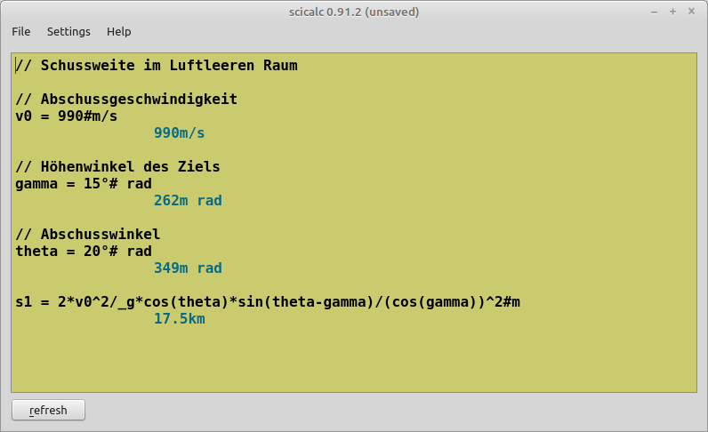

scicalc
=======



# Bedienungsanleitung

## 1. Einfuehrung

**scicalc** ist ein numerisches Berechnungsprogramm fuer den PC. Es verbindet
die direkte Arbeitsweise eines Taschenrechners mit der Wiederholbarkeit eines
kleinen Rechenskripts. Eingaben stehen dauerhaft im Dokument, Ergebnisse werden
direkt darunter angezeigt.

Seit Version 2.0 unterstuetzt scicalc neben Skalaren auch erste
Matlab-aehnliche Vektor- und Matrixausdruecke.

## 2. Bedienung

Im Textfeld koennen Rechenanweisungen eingegeben werden. Um die Berechnung zu
aktualisieren, beenden Sie die aktuelle Zeile mit Return oder druecken Sie
Strg+R.

Variablen, Konstanten und Funktionen werden beim Tippen vorgeschlagen. Die
Vorschlagsliste erscheint automatisch ab dem ersten Zeichen eines Namens oder
manuell mit Strg+Space. Bei Variablen wird der aktuelle Wert angezeigt; bei
Matrizen die Dimension.

## 3. Zahlen und Einheiten

scicalc rechnet numerisch mit reellen Gleitkommazahlen. Als Dezimaltrennzeichen
werden `.` und `,` akzeptiert. In Matrixliteralen trennt `,` jedoch Spalten,
damit Matlab-Syntax wie `[1, 2; 3, 4]` funktioniert.

Zahlen koennen mit Zehnerpotenzen und SI-Praefixen eingegeben werden:

```
1e3       1000
2.5e-3    0.0025
3k        3000
4M        4000000
6m        0.006
7u        0.000007
```

Das Gradzeichen wandelt Winkelwerte in Radiant um:

```
sin(30°)
        500m
```

Mit `#` kann eine Ausgabeeinheit angehaengt werden:

```
force=3 #N
        3N
resistance=470 #Ohm
        470Ω
```

Einheiten sind reine Ausgabeformatierung und kein Einheitensystem. `#Ohm` wird
in der Ausgabe als `Ω` dargestellt.

## 4. Kommentare

Kommentare beginnen mit `//` oder `%` und gelten bis zum Ende der Zeile.

```
length=3.5  // Laenge
% Matlab-artiger Kommentar
```

## 5. Skalare Ausdruecke

Unterstuetzt werden:

```
+  -  *  /  ^  ()
```

Die ueblichen Vorrangregeln werden beachtet:

```
2+3*5^2
        77
```

Negative Exponenten muessen geklammert werden:

```
2^(-3)
        125m
```

Der Paralleloperator `||` berechnet Parallelschaltungen:

```
100||200
        66.6667
```

## 6. Variablen und Konstanten

Variablen werden mit `=` gesetzt:

```
a=3
b=2*a+1
b
        7
```

`$` enthaelt das Ergebnis der letzten berechneten Zeile.

Vordefinierte Konstanten:

```
pi      Kreiszahl

_g      Erdbeschleunigung
_G      Gravitationskonstante

_mu0    Permeabilitaet des Vakuums
_eps0   Permittivitaet des Vakuums
_c0     Lichtgeschwindigkeit im Vakuum
_e      Elementarladung

_kB     Boltzmann-Konstante
_h      Plancksches Wirkungsquantum
```

## 7. Funktionen

```
sqrt(x)             Quadratwurzel
exp(x)              Exponentialfunktion
log(x), ln(x)       natuerlicher Logarithmus
log10(x)            dekadischer Logarithmus
ceil(x)             Aufrunden
floor(x)            Abrunden
round(x)            Runden
sin(x), cos(x)      Winkelfunktionen in Radiant
tan(x)
asin(x), acos(x)    inverse Winkelfunktionen in Radiant
atan(x), atan2(y,x)
abs(x)              Betrag
rad2deg(x)          Radiant nach Grad
inv(A)              Matrix invertieren
getVersion()        scicalc-Version ausgeben
```

Skriptweite Anzeigeoptionen:

```
setDigits(n)         Anzahl signifikanter Stellen temporaer festlegen (1..15)
setTrailingZeros(b)  abschliessende Nullen ein-/ausschalten (0 oder 1)
setAccounting(b)     Accounting-Modus temporaer ein-/ausschalten (0 oder 1)
```

Diese Funktionen koennen je Refresh einmal verwendet werden.

Alle einargumentigen mathematischen Funktionen werden elementweise auf Vektoren
und Matrizen angewendet. `atan2(y,x)` wird ebenfalls elementweise ausgewertet
und unterstuetzt Skalar-Broadcast.

## 8. Vektoren und Matrizen

Matrix- und Vektorwerte verwenden ein Matlab-aehnliches Literalformat:

```
[1 2 3]          Zeilenvektor
[1; 2; 3]        Spaltenvektor
[1 2; 3 4]       2x2-Matrix
[1, 2; 3, 4]     Kommas als Spaltentrenner
```

Hinweis: Ausserhalb von Matrixliteralen kann wie bisher das Dezimalkomma
verwendet werden, z.B. `5,4`. Innerhalb von `[...]` folgt scicalc der
Matlab-Syntax: Kommas trennen Elemente. Dezimalzahlen in Vektoren und Matrizen
daher mit Punkt schreiben, z.B. `[5.4 6 7]`.

Ranges erzeugen Zeilenvektoren:

```
1:5
        [1 2 3 4 5]
1:2:9
        [1 3 5 7 9]
5:-2:1
        [5 3 1]
```

Unterstuetzte Matrixoperatoren:

```
A+B      elementweise Addition, mit Skalar-Broadcast
A-B      elementweise Subtraktion, mit Skalar-Broadcast
A*B      Matrixmultiplikation
A/2      Matrix durch Skalar
A/B      A * inv(B)
A.*B     elementweise Multiplikation
A./B     elementweise Division
A.^B     elementweise Potenz
A'       Transponieren
inv(A)   Invertieren quadratischer Matrizen
```

Mehrzeilige Matrizen werden spaltenweise ausgerichtet und mit einem Rahmen
angezeigt:

```
matrixA=[1 2; 3 4]
        ⎡ 1 2 ⎤
        ⎣ 3 4 ⎦
```

scicalc-Suffixe bleiben auch in Matrizen aktiv:

```
matrixA/2
        ⎡ 500m 1 ⎤
        ⎣  1.5 2 ⎦
```

Noch nicht implementiert sind Matrixpotenzen mit `^`, Indexzugriffe wie
`A(1,2)` und linke Matrixdivision `\`.

## 9. Accounting-Modus

Im Einstellungsdialog kann ein Accounting-Modus aktiviert werden. Beginnt eine
Zeile mit `+`, `-`, `*`, `/` oder `^`, wird das Ergebnis der vorherigen
berechneten Zeile automatisch vorangestellt. Leere Zeilen und Kommentare werden
uebersprungen.

## 10. Speichern und Laden

scicalc kann Skripte speichern und laden. Optional kann beim Beenden automatisch
gespeichert und beim Start die letzte Datei geladen werden.

## 11. Demo- und Testdateien

```
test-demo.sc    anschauliche Demo der wichtigsten Funktionen
test-cases.sc   Regressionstest mit Erfolgs- und Fehlerfaellen
```

## 12. Bauen

Ab Version 2.0 wird CMake verwendet. Unter Debian/Ubuntu:

```
sudo apt install build-essential cmake qtbase5-dev libeigen3-dev
cmake -S . -B build
cmake --build build
```

Die ausfuehrbare Datei liegt danach unter:

```
build/scicalc
```

Die Buildnummer wird bei jedem Build automatisch erhoeht. `getVersion()` zeigt
die Version inklusive dreistelliger Buildnummer an, z.B. `2.0.1-###`.

## 13. Debian-Paket

Ein Debian-Paket kann mit CPack erzeugt werden:

```
cpack --config build/CPackConfig.cmake
```

Das Paket wird im Unterverzeichnis `debian/` abgelegt. Es installiert:

```
/usr/bin/scicalc
/usr/share/applications/scicalc.desktop
/usr/share/icons/hicolor/scalable/apps/scicalc.svg
/usr/share/pixmaps/scicalc.png
```

## 14. Grenzen

scicalc ist ein numerischer Rechner. Nicht vorgesehen sind derzeit:

* symbolische Mathematik
* eigene Funktionen im Skript
* Kontrollstrukturen wie Schleifen oder Verzweigungen
* komplexe Zahlen
* Matrix-Indexzugriffe und linke Matrixdivision

# Autoren und Lizenz

Autoren:

* Friedrich Feichtinger
* Karl Zeilhofer

scicalc wird unter der GNU GPL V2 veroeffentlicht. Verwenden Sie den Rechner
auf eigenes Risiko; Programmier- und Rechenfehler koennen nicht ausgeschlossen
werden.
